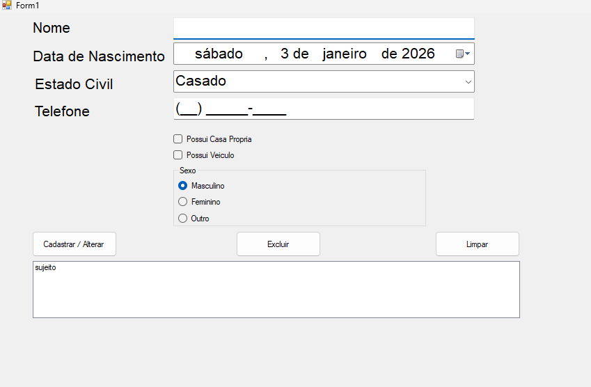

# Sistema de Cadastro em C#

Este projeto é um **sistema de cadastro** simples desenvolvido em **C#**, que permite ao usuário cadastrar, visualizar e gerenciar informações de uma lista de registros (por exemplo, clientes, produtos, etc.). A interface foi criada para ser **simples e fácil de usar**, focando na funcionalidade básica de um sistema de gerenciamento de dados.

---

## Funcionalidades

* **Cadastrar registros**: Inserir dados no sistema de cadastro.
* **Listar registros**: Visualizar todos os registros cadastrados.
* **Editar registros**: Alterar dados de um cadastro existente.
* **Deletar registros**: Remover registros do sistema.

---

## 🖼️ Interface do Aplicativo



--

## Tecnologias Utilizadas

* **C#**
* **.NET Framework**
* **Windows Forms**

---

## Como Executar o Projeto

1. **Clone o repositório**:

   ```bash
   git clone https://github.com/andrewSouza-dev/SistemCadadastro.git
   ```

2. **Abra o projeto no Visual Studio**:

   * Clique em **File → Open → Project/Solution**
   * Abra o arquivo **SistemCadadastro.sln**

3. **Execute o projeto**:

   * Pressione **F5** ou clique em **Iniciar**

4. **Interaja com o sistema**:

   * Caso seja uma **aplicação de console**, você verá o menu de opções no terminal.
   * Caso seja **Windows Forms**, utilize a interface gráfica para cadastrar e visualizar os dados.

---

## Como Funciona

O sistema tem como objetivo gerenciar um conjunto de **registros**. Ao iniciar o aplicativo, o usuário poderá:

1. **Cadastrar** novos registros (insira informações como nome, idade, endereço, etc.).
2. **Visualizar** todos os registros cadastrados em uma lista.
3. **Editar** registros existentes.
4. **Deletar** registros da lista.

---

## Melhorias Futuras

* Adicionar **autenticação** de usuários (login, senhas).
* Implementar um **sistema de busca** para encontrar registros rapidamente.
* Adicionar **campos validados** para garantir que os dados inseridos estão corretos (ex: CPF, email, etc.).
* Criar **relatórios** exportáveis em PDF ou Excel.
* Implementar **backup de dados** em nuvem.

---

## Licença

Este projeto está sob a licença **MIT**.
Sinta-se à vontade para usar, modificar e redistribuir conforme necessário.

---

## Autor

**Andrew Souza**
🔗 GitHub: [andrewSouza-dev](https://github.com/andrewSouza-dev)

---

